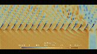
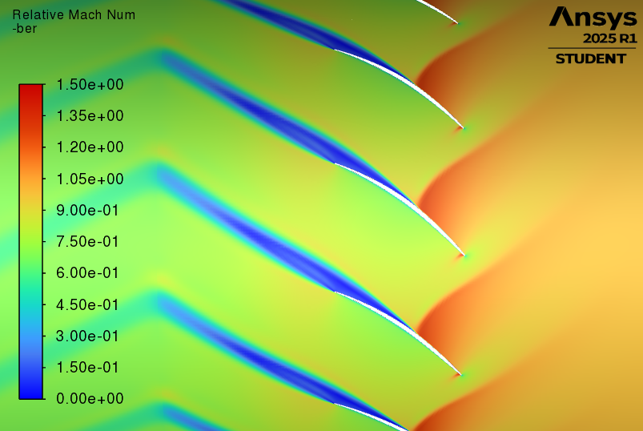
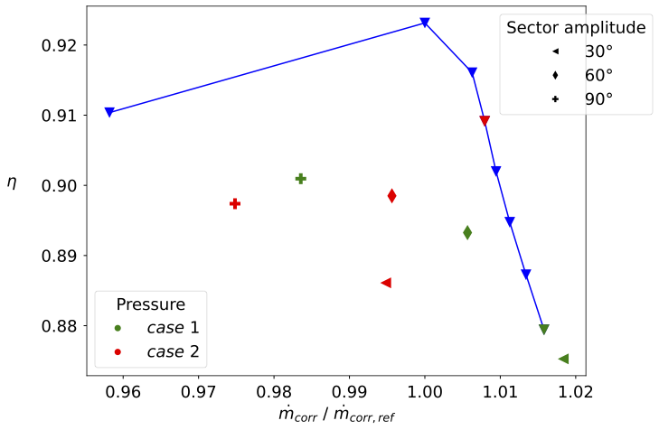
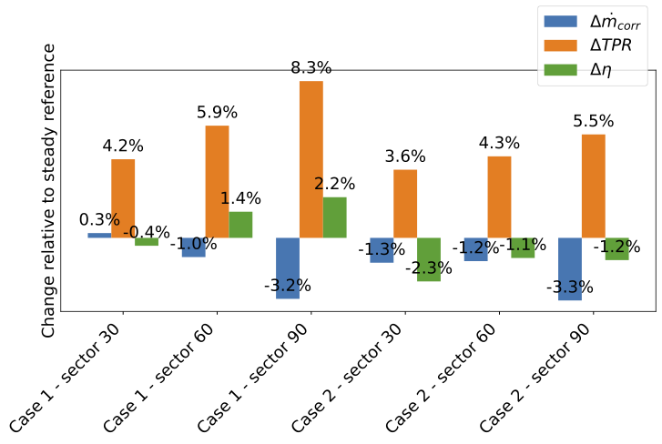

# CFD Investigation of Inlet Distortion Effects on a Compressor Blade Row

## Project Overview

This work investigates the aerodynamic impact of inlet total pressure distortion on a compressor blade cascade representative of modern turbomachinery applications.

The study focuses on performance degradation, flow instability, and non-uniform rotor loading under distorted inflow conditions typical of high-performance aero-engine architectures.

The objective is to quantify how inlet distortion affects compressor efficiency, pressure ratio, and unsteady flow structures using a combination of steady and unsteady CFD methodologies.

---

## Objectives

- Quantify erodynamic penalties induced by inlet flow distortion
- Reproduce irealistic total pressure distortion patterns at compressor inlet
- Assess impact on:
  - Total pressure ratio (TPR)
  - Isentropic efficiency
  - Mass flow rate
- Investigate unsteady flow mechanisms linked to distortion propagation
- Develop a reduced-cost CFD strategy suitable for early design phase analysis

---

## Numerical Methodology

### Solver and Numerical Framework
- ANSYS Fluent (density-based solver)
- Fully compressible formulation

### Turbulence Modelling
- k-ω standard
- k-ε with enhanced wall treatment 
- Spalart–Allmaras 

### Mesh Strategy
- Structured topology
- Near-wall resolution: y⁺ < 1
- Grid independence assessment:
  - Coarse: 38,700 cells  
  - Medium: 64,029 cells  
  - Fine: 138,447 cells  

### Boundary Conditions
- Total pressure inlet with imposed distortion sector
- Static pressure outlet

### Inlet Distortion Definition
- Sector amplitudes: 30°, 60°, 90°
- Total pressure deficit levels:
  - 10% (104 kPa)
  - 20% (100 kPa)

---

## Simulation Strategy

To ensure physical consistency and computational efficiency, three levels of fidelity were adopted:

- **Steady RANS (single passage):**
  Turbulence model selection and mesh sensitivity study

- **Steady RANS (full annulus):**
  Baseline reference solution without time dependency

- **URANS (full annulus):**
  Time-resolved simulation capturing:
  - Distortion transport
  - Unsteady rotor loading
  - Flow separation and vortex dynamics

---

## Key Findings

- Inlet distortion leads to a measurable reduction in compressor mass flow rate and overall performance
- Efficiency degradation is strongly dependent on distortion intensity and operating condition
- Significant circumferential non-uniformity in rotor loading is observed
- Shock system displacement is detected under high distortion cases
- Unsteady simulations reveal:
  - Vortex shedding phenomena
  - Localised flow separation
  - Enhanced temporal fluctuations in pressure and velocity fields

---

## Post-Processing and Data Analysis

Post-processing was carried out using Paraview and custom Python automation scripts developed for batch processing and quantitative evaluation.

Extracted metrics include:
- Pressure ratio evolution across operating points
- Isentropic efficiency maps
- Mach number distributions
- Time-resolved URANS field analysis
- Distortion propagation tracking

---

## Computational Environment

- High Performance Computing (HPC) on CINECA infrastructure
- Linux-based workflow automation
- Batch simulation management and post-processing scripting
- Parallel execution of multi-case parametric studies

---

## Core Technical Skills Demonstrated

- CFD (RANS / URANS) applied to turbomachinery flows
- Aerodynamic analysis of compressor cascades
- Mesh independence and numerical verification
- Turbulence modelling assessment and selection
- High-fidelity post-processing and data reduction
- HPC computing workflows (CINECA)
- Linux environment and automation scripting (Python-based pipeline)

---

## Selected Results

  

  

  

  

